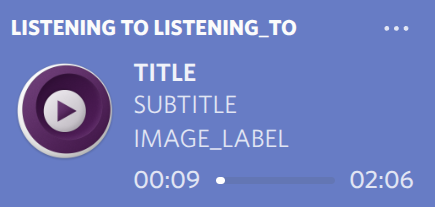

# YAMPR


**Y**et **A**nother **MP**RIS Discord **R**PC Client

"What a great acronym!"\
\- Satisfied YAMPR user

[](https://github.com/qwertyquerty/pypresence)

Features I haven't seen elsewhere:
- **Custom Covers:** Your local album covers are uploaded to a service of your choosing, meaning your obscure, undocumented-online music actually display their covers!
  - The links are stored in a json file, so you can easily swap around or add images to songs without them
  - Currently, only pomf.lain.la is supported, but adding new services is (theoretically) extremely straight forward
- **Configurability:** Customize the appearance of your rich presence to your liking. The possibilities are endless! (not really, but still)
- **Instant Updating:** Thanks to the power of asyncio, your rich presence will update instantly when you start a new song.

## Setup
If you're on Arch:
```commandline
pacman -S python-pypresence python-pydbus python-requests
yay -S python-tinytag
```
Alternatively, make a venv and install requirements with pip
```commandline
python -m venv venv
source venv/bin/activate
pip install -r requirements.txt
```
Make sure your music player (or its backend) supports MPRIS. For example, mpv requires the mpv-mpris plugin.
# Usage
Just run rpc.py
```commandline
python yampr
```
You can configure the appearance of your rich presence in config.py



```python
LISTENING_TO = "LISTENING_TO"
TITLE = "TITLE"
SUBTITLE = "SUBTITLE"
IMAGE_LABEL = "IMAGE_LABEL"
```
